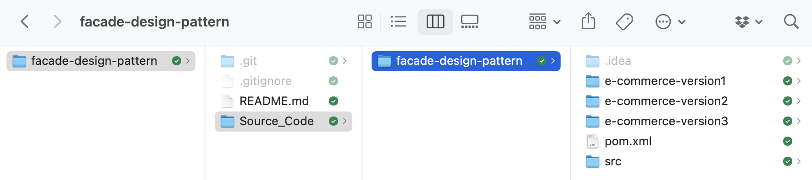

# Facade design pattern and the design principle of the least knowledge

Repository with source code of the examples used in the classes about the design pattern Facade and the design principle of the least knowledge, taught by Rodrigo Martins Pagliares at UNIFAL-MG.

## Examples

I use a simple Java program that evolves from a simple example without the use of the Facade design pattern to a final version that uses Facade and adheres to the design principle of least knoledge.

To ease contrasting the evolution of the examples in this directory, I created a Multi Module Maven Project. In this way, all examples can be loaded and built together in the IDE of your choice (I use IntelliJ IDEA Ultimate Edition).

To open the examples in your IDE, open/import the parent project (folder highlighted in blue in the Figure).

    

### e-commerce-version1

This example is the initial version of our simplified e-commerce program. Although it works, it demands using several classes in order to accomplish a product purchase. The example does not use the Facade design pattern.

### e-commerce-version2

This example builds upon the first example by adding the Facade design pattern to our solution. This eases the process of making a purchase in our example e-commerce system. This version does not adhere to the principle of least knowledege (don't talk with strangers/Demetrius' Law).

### e-commerce-version3

This final example applies the design principle of least knowlege (A.K.A don't talk to strangers or Demetrius' Law). This decouples the Facade of the Shopping Cart, since the Customer already has a reference to it. 
